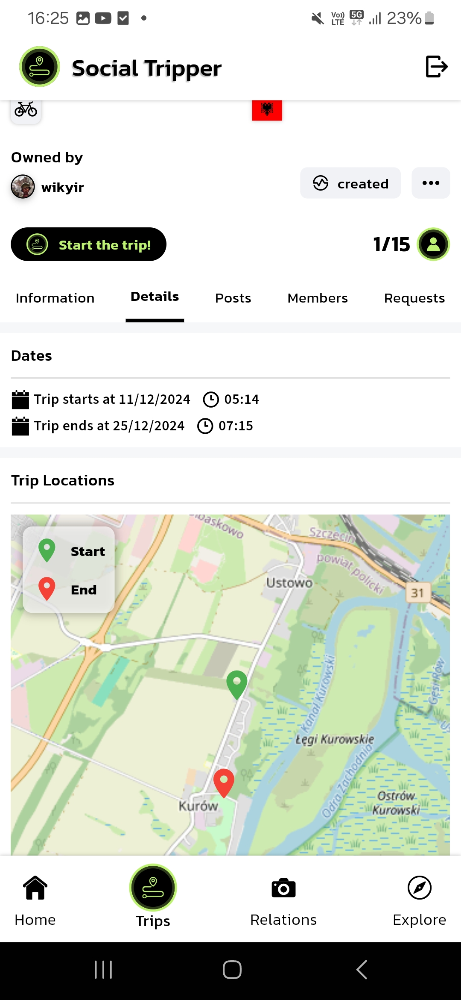
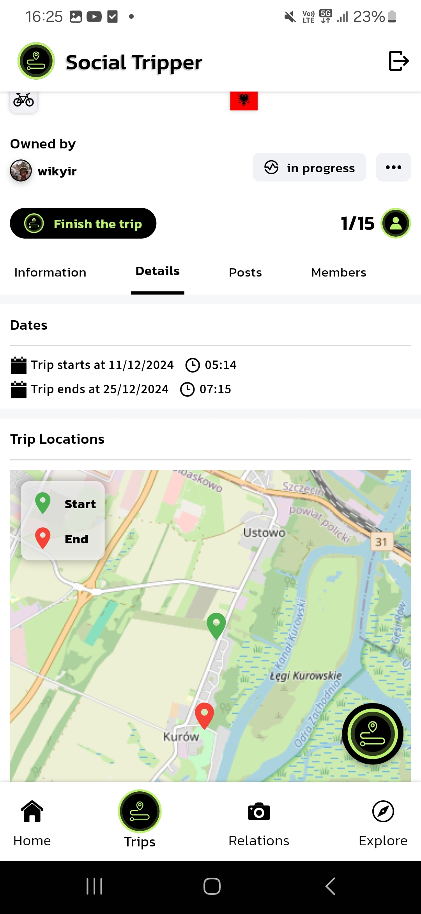
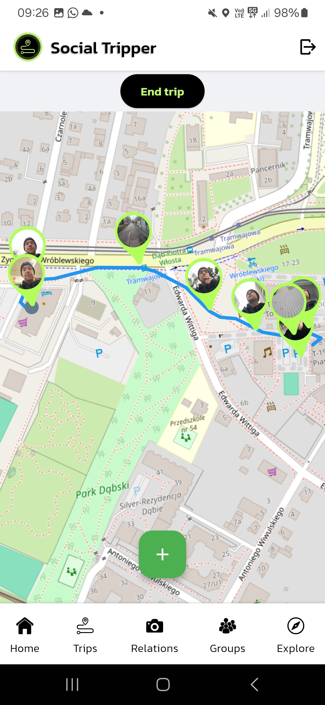
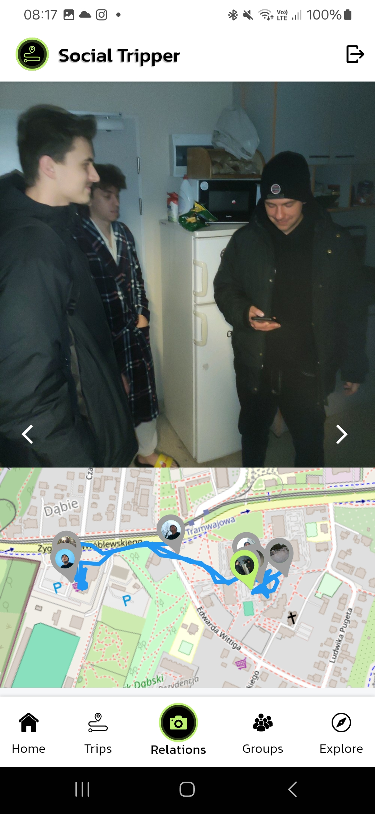

<p align="center">
   
</p>

## Cel Projektu
Celem projektu było opracowanie zaawansowanego portalu społecznościowego, który integruje funkcje organizowania podróży z możliwością dzielenia się relacjami z wyjazdów. Portal łączy funkcjonalności aplikacji typu social media z narzędziami do planowania i realizacji podróży. Projekt obejmował stworzenie dwóch aplikacji:

- **Aplikacja mobilna**
- [**Aplikacja webowa**](https://docs.amplify.aws/gen1/flutter/start/project-setup/prerequisites/)

Obie aplikacje współpracują z bazami danych, które przechowują informacje o użytkownikach, wydarzeniach i materiałach multimedialnych. System wspiera użytkowników w organizowaniu wyjazdów oraz budowaniu społeczności wokół wspólnych pasji. Oferuje także system rekomendacji, który na podstawie preferencji użytkowników sugeruje interesujące wyjazdy oraz osoby o podobnych zainteresowaniach. 

## Aplikacja Mobilna: Social Tripper
### Opis Funkcjonalności
Aplikacja mobilna, przeznaczona na system Android, stanowi dodatek do portalu społecznościowego, realizując następujące funkcje:

1. **Unikalne Funkcjonalności Podróżnicze**:
   - Rozpoczynanie wyprawy.
   - Przesyłanie zdjęć i filmów przypisanych do lokalizacji na trasie.
   - Zakończenie wyprawy i generowanie "Relacji", która zawiera przebyte trasy, multimedialne pinezki i galerię multimediów.

2. **Standardowe Funkcjonalności Social Media**:
   - Przeglądanie postów i wypraw.
   - Aplikowanie do wydarzeń.
   - Logowanie i rejestracja użytkowników z wykorzystaniem AWS Amplify.

3. **Interfejs Mapy**:
   - Możliwość przeglądania i planowania tras podróży.

### Link do Pliku APK
Gotowa wersja aplikacji jest dostępna do pobrania i testowania: [Social Tripper APK](https://apkfab.com/socialtrippermobile/com.example.social_tripper_mobile/apk?h=4cdd19b24d161b30b1885665a9ade39317a36015470e0fa306bbbec5a185225c)

## Instrukcja Kompilacji
Aby skompilować aplikację mobilną, należy najlepiej użyć środowiska Android Studio (wersja Koala) i wykonać następujące kroki:

### Kompilacja w Trybie Debug:
```bash
flutter clean
flutter pub get
flutter run
```

### Kompilacja w Trybie Release:
```bash
flutter clean
flutter pub get
flutter run --release
```

### Wymagane Komponenty:
- **AWS Amplify**: Szczegóły konfiguracji dostępne są [tutaj](https://docs.amplify.aws/gen1/flutter/start/project-setup/prerequisites/).
- **Backend**: Kod dostępny w repozytorium [SocialTripper_Backend](https://github.com/Lehito15/SocialTripper_Backend).
- **Serwer WebSocket**: Kod dostępny w repozytorium [SocialTripper_WebSocket](https://github.com/betonowylukasz/SocialTripper_WebSocket).

### Modyfikacja Odnośników w Kodzie
Aby podłączyć aplikację do działającego backendu i serwera WebSocket, należy:
1. W pliku `lib/Pages/config/data_retrieving_config.dart` ustawić wartość `sourceUrl` na odpowiedni adres backendu.
2. W pliku `lib/Pages/trip_interface.dart` zaktualizować atrybuty `fileServerAddress` oraz `client` do nowych adresów serwera WebSocket.

## Demonstracja Działania Aplikacji
1. **Tworzenie Wydarzenia**: 
   - Widok ogólny i szczegółowy wydarzenia. 
   - Opcja rozpoczęcia wydarzenia, która prowadzi do interfejsu wyprawy.

<table>
  <tr>
    <td align="center"><br><b>Widok Wydarzenia (Ogólny)</b></td>
    <td align="center"><br><b>Widok Wydarzenia (Szczegółowy)</b></td>
    <td align="center"><br><b>Rozpoczęte Wydarzenie</b></td>
  </tr>
</table>

2. **Realizacja Wyprawy**:
   - Podczas wyprawy: możliwość dodawania multimediów i przypisywania ich do lokalizacji.

<table>
  <tr>
    <td align="center"><br><b>Wyprawa w toku</b></td>
  </tr>
</table>

3. **Relacja**:
   - Produkt końcowy wyprawy w formie interaktywnej mapy trasy z multimedialnymi pinezkami i galerią.

<table>
  <tr>
    <td align="center"><br><b>Relacja</b></td>
  </tr>
</table>


## Instrukcja Użytkowania
Szczegółowe informacje na temat obsługi aplikacji mobilnej oraz dostępnych funkcjonalności znajdują się w [instrukcji użytkownika](link_do_instrukcji).
